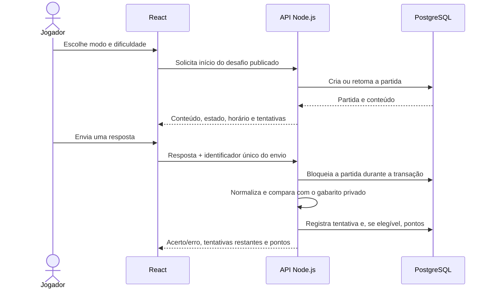
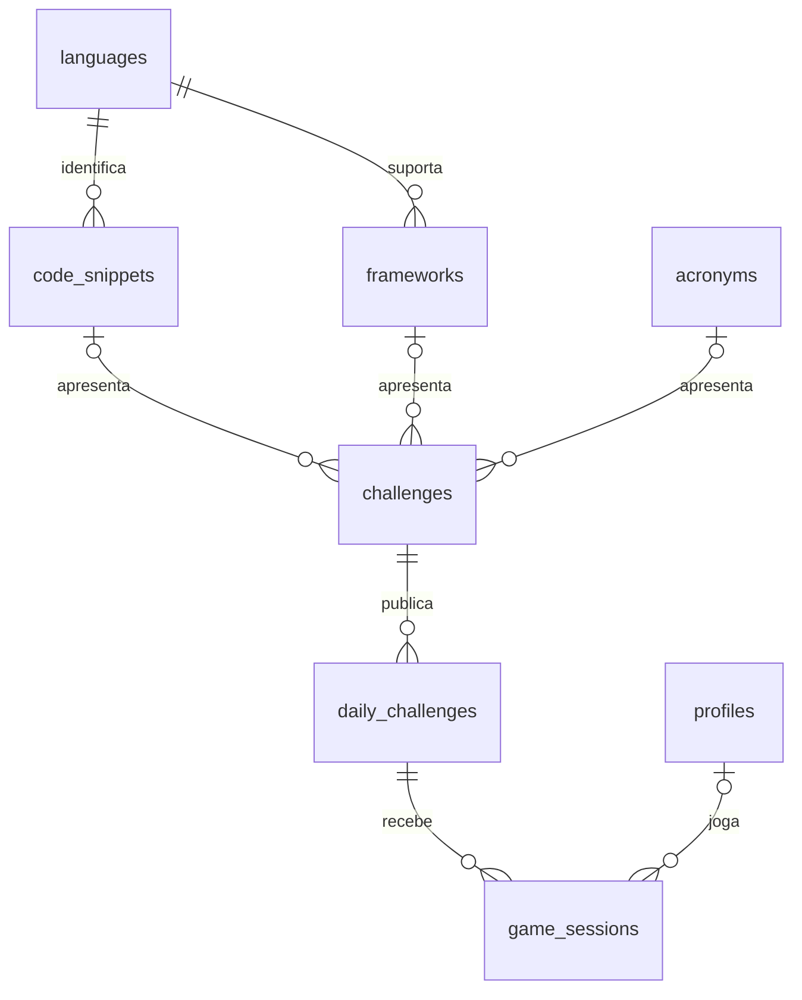

# Mapa do projeto

Este documento descreve a implementação da primeira versão e suas decisões. O README é a apresentação pública; este arquivo registra o funcionamento técnico.

## Organização

| Caminho                                 | Responsabilidade                                                                                            |
| --------------------------------------- | ----------------------------------------------------------------------------------------------------------- |
| `web/`                                  | Interface React, estilos, componentes, navegação e cliente HTTP. É a única aplicação entregue ao navegador. |
| `web/src/components/CodeEditor.tsx`     | Exibição do trecho como texto, numeração e destaque genérico de tokens.                                     |
| `web/src/components/GameBoard.tsx`      | Início da partida, envio de palpites, cronômetro visual, histórico e resultado.                             |
| `web/src/components/LanguagePicker.tsx` | Seleção pesquisável com interação por teclado.                                                              |
| `web/src/components/OtherPages.tsx`     | Arquivo e ranking.                                                                                          |
| `server/app.ts`                         | Rotas HTTP, validação dos formatos, limites de requisições e respostas públicas.                            |
| `server/game-service.ts`                | Início e retomada de partidas, validação de respostas, transações e rankings.                               |
| `server/domain.ts`                      | Normalização, cálculo dos pontos e datas no fuso do jogo.                                                   |
| `server/auth.ts`                        | Verificação de sessão Google e identidade de visitantes; conta local de revisão.                            |
| `server/db.ts`                          | Adaptadores para PostgreSQL remoto e PGlite local, usando o mesmo SQL.                                      |
| `server/seed.ts`                        | Catálogo demonstrativo privado em relação à interface. Não integra o build web.                             |
| `shared/contracts.ts`                   | Tipos dos dados públicos; não contém entidades privadas ou respostas.                                       |
| `database/migrations/`                  | Estrutura SQL versionada.                                                                                   |
| `tests/`                                | Regras, API, persistência e jornadas de navegador.                                                          |
| `scripts/verify-public.mjs`             | Verificação do build web contra conteúdo privado conhecido.                                                 |
| `.vscode/`                              | Configuração de editor e tarefas locais.                                                                    |

## Fluxo de uma partida

O conteúdo só é revelado após clicar em **Começar desafio**. Isso define um início explícito para o cronômetro e permite entrar antes da partida. Fechar a aba, trocar o modo ou atualizar a página não reinicia o relógio. A retomada retorna a mesma partida do dia para aquela identidade.

## Modelo do banco

As tabelas ficam no schema privado `game`, separado dos dados de autenticação gerenciados pelo Supabase.

| Tabela              | O que armazena                                                                                                                               | Relações principais                                               |
| ------------------- | -------------------------------------------------------------------------------------------------------------------------------------------- | ----------------------------------------------------------------- |
| `profiles`          | Identidade, nome público, avatar e total de pontos. Não armazena senha ou e-mail. | Recebe partidas de jogadores autenticados. |
| `languages`         | Linguagens e sua dificuldade fixa: fácil, média ou difícil. | Referenciada por trechos e frameworks. |
| `code_snippets`     | Código, linguagem principal, chave editorial e outras linguagens aceitas para o mesmo trecho. | Cada trecho aponta diretamente para uma linguagem. |
| `frameworks`        | Nome, linguagem principal e outras linguagens aceitas. | Referencia `languages`. |
| `acronyms`          | Sigla e sua definição. A API normaliza e compara respostas sem diferenciar maiúsculas e minúsculas. | Referenciada por desafios de sigla. |
| `challenges`        | Tipo e vínculo exclusivo com um trecho, framework ou sigla. | Referencia o catálogo correspondente. |
| `daily_challenges`  | Publicação de um desafio em uma data e posição: fácil, médio, difícil, sigla ou framework.                                                   | Liga o catálogo editorial ao calendário.                          |
| `game_sessions`     | Partida, estado, pontos e até cinco tentativas em `guesses` (`jsonb`), com texto, forma normalizada, resultado e identificador do envio. | Pertence a uma publicação e, quando conectado, a um perfil. |
| `language_hints`    | Descrição curta de cada linguagem, ligada por `language_id`. A API só a envia após três erros na partida. | Pertence a uma linguagem. |
| `schema_migrations` | Migrações já aplicadas.                                                                                                                      | Controle técnico de versões do banco.                             |

Separar trecho, desafio e publicação permite reutilizar a estrutura do catálogo sem vincular um código permanentemente a uma data. A linguagem principal vem de `code_snippets.language_id`; ela nunca é incluída na resposta pública. `accepted_language_names` guarda alternativas legítimas específicas do trecho. No catálogo demonstrativo, o trecho em JavaScript também aceita TypeScript.

O dropdown recebe a lista **completa** de nomes de `languages`, sempre sem relações com desafios ou filtros por gabarito. Não há um endpoint público para consultar aliases, respostas ou registros dos trechos.

## Validação das respostas

1. A API verifica a identidade e se a partida pertence à pessoa que fez a requisição.
2. Valida o formato do envio: UUID da partida, UUID de idempotência e resposta entre 1 e 160 caracteres. Campos extras são rejeitados.
3. Bloqueia a linha da partida durante a transação, impedindo duas alterações simultâneas no mesmo estado.
4. Confere o dia, o estado da partida, a quantidade de tentativas e se aquele envio já foi processado.
5. Normaliza a resposta, resolve aliases definidos no servidor e compara com as relações privadas no banco.
6. Registra o resultado e os pontos na mesma transação.

**Linguagens:** normalização Unicode NFKC, letras minúsculas, remoção de espaços nas extremidades e redução de espaços repetidos. Os símbolos `#` e `+` são preservados: `C`, `C#` e `C++` não viram a mesma resposta. Abreviações precisam estar cadastradas. Nomes desconhecidos retornam uma orientação e não consomem tentativa.

**Siglas:** comparação do termo completo em inglês, desconsiderando caixa, acentos, pontuação separadora e espaços repetidos. `Object-Oriented Programming` equivale a `object oriented programming`. Palavras ausentes ou significados diferentes não são aceitos. Não há correção aproximada por IA.

Uma resposta repetida não consome uma nova tentativa; aliases da mesma linguagem também contam como repetição. Uma requisição reenviada com o mesmo identificador e o mesmo texto retorna o resultado já registrado. Reutilizar esse identificador com outro texto é rejeitado.

## Pontuação

| Desafio        | Base | Máximo na primeira tentativa |
| -------------- | ---: | ---------------------------: |
| Código fácil   |  100 |                          125 |
| Código médio   |  200 |                          250 |
| Código difícil |  300 |                          375 |
| Sigla          |  100 |                          125 |
| Framework      |  100 |                          125 |

A regra v1 é:

**Pontos = arredondar((base + bônus de tempo) × fator da tentativa).**

O bônus começa em 25% da base e cai linearmente até zero aos 120 segundos. O fator vale 1 na primeira tentativa, 0,7 na segunda, 0,4 na terceira, 0,2 na quarta e 0,1 na quinta. Depois de dois minutos ainda é possível acertar e receber a base ajustada pelas tentativas. Exemplo: um desafio médio acertado em 60 segundos na segunda tentativa rende **158 pontos**.

O máximo teórico por edição é 1.000 pontos. O tempo considerado vem dos horários registrados no servidor; o cronômetro da tela apenas apresenta essa informação.

Só uma partida iniciada com autenticação, referente à edição atual, pode pontuar. Visitantes, treinos e partidas vencidas pela virada do dia recebem zero. Entrar depois de jogar como visitante não migra ou credita o resultado anterior: contas e visitantes possuem identidades separadas.

Os pontos não são enviados pelo cliente. A vitória atualiza `profiles.points` na mesma transação que registra `game_sessions.points`; partidas reenviadas não duplicam a atualização. O ranking mensal usa a data de `daily_challenges` e os pontos das partidas, enquanto o geral usa todas as partidas pontuadas.

O ranking mensal filtra a data da edição no mês de Brasília; o geral usa todos os eventos. O histórico não é apagado na virada do mês. Os desempates são: mais acertos, primeiro evento de pontuação mais antigo e UUID do perfil para ordenação estável. A API retorna os 100 primeiros e a posição do próprio jogador mesmo quando ele estiver fora dessa lista.

## Proteção da resposta

- A interface recebe um DTO com campos explicitamente permitidos, nunca uma linha SQL inteira.
- O DTO inclui o conteúdo, o estado, as tentativas do próprio jogador e os pontos. Não inclui linguagem principal, IDs de linguagem, aliases, respostas aceitas, chave editorial ou proveniência do trecho.
- O lexer visual é o mesmo para todos os trechos. Ele colore strings, números, comentários e um conjunto genérico de palavras. Não recebe um nome de linguagem, não faz autodetecção e não adiciona atributos `data-language` ou classes `language-*`.
- O código é renderizado como texto escapado pelo React. Não é executado nem inserido com HTML arbitrário.
- O servidor devolve apenas acerto/erro; nem mesmo a derrota envia o gabarito oculto.
- O servidor Vite permite somente a interface, os contratos públicos e dependências. Os diretórios do servidor, banco e arquivos de ambiente estão bloqueados.
- O build de produção contém somente os arquivos de `web/` e não publica sourcemaps.
- O schema `game` não concede acesso a `PUBLIC`, `anon` ou `authenticated`. A conexão SQL é exclusiva do servidor e não usa o cliente Supabase do navegador para ler essas tabelas.
- Endpoints do jogo usam `Cache-Control: no-store`; dados de uma partida não são compartilhados por cache entre usuários.

Isso protege a relação oculta entre trecho e resposta. O próprio código permanece visível, e pesquisas externas, múltiplas contas ou consultas a outras pessoas continuam possíveis em um jogo aberto. O seed do repositório também é conhecido: serve para demonstração e não deve ser usado como catálogo secreto de uma competição pública.

## Banco local e conexão remota

Sem `DATABASE_URL`, o servidor utiliza PGlite, uma distribuição PostgreSQL embutida, executada **apenas no Node.js**. Não há banco, gabarito ou catálogo privado no armazenamento do navegador. No Windows, os arquivos ficam em `%LOCALAPPDATA%/WhatIsTheSyntax/<identificador-do-projeto>/pglite`, fora do OneDrive. Em outros sistemas, ficam em `.data/pglite`. `LOCAL_DATABASE_DIR` permite escolher outro caminho.

Esse armazenamento local é para um processo de desenvolvimento. A API e os comandos de migração não devem abrir a mesma pasta de PGlite simultaneamente. Não é o armazenamento de uma implantação serverless.

Com `DATABASE_URL`, o adaptador utiliza `pg.Pool`, consultas parametrizadas e transações PostgreSQL. O pool tem até cinco conexões por processo; em hospedagem com várias instâncias, a conexão deve passar por um pooler dimensionado para a carga. `DATABASE_SSL=true` ativa TLS com verificação do certificado; a implementação não desabilita sua validação.

O ambiente local aplica a migração e carrega os exemplos automaticamente. No banco remoto, a aplicação exige migrações já aplicadas e não insere exemplos na inicialização. Em produção, a ausência de conexão PostgreSQL ou configuração de autenticação impede o início do servidor.

Para atualizar um Supabase já na versão 004 pelo SQL Editor, execute `database/supabase_manual_five_attempts_and_hints.sql`. Novas linguagens publicadas precisam de uma linha em `game.language_hints` ligada ao respectivo `language_id`; o catálogo demonstrativo preenche essas linhas automaticamente.

As publicações remotas são orientadas a dados: cada dia precisa de cinco registros em `daily_challenges`. O backend consulta a data atual, portanto não depende de um job executado exatamente à meia-noite. Quando não existe publicação, a interface mostra uma edição indisponível. Em desenvolvimento, os exemplos do novo dia são preparados no próximo carregamento.

## Autenticação e ambiente

O frontend usa o fluxo OAuth PKCE do Supabase. A API verifica o token com `auth.getUser()` e só então vincula o resultado ao perfil. O nome público inicial é um pseudônimo editável; a alteração não modifica o identificador ou os eventos de pontos. A foto Google é atualizada a partir da identidade verificada e aceita apenas URLs HTTPS de `googleusercontent.com`. E-mail e nome completo do Google não aparecem automaticamente no ranking.

`SUPABASE_URL` e `SUPABASE_PUBLISHABLE_KEY` formam a configuração pública necessária para iniciar o login. A API rejeita configurações com chave secreta ou `service_role` para impedir que uma credencial administrativa seja enviada ao navegador.

Visitantes recebem um cookie assinado com HMAC, `HttpOnly`, `SameSite=Lax` e `Secure` em produção. Não há tabela de visitantes; as até cinco tentativas ficam no campo `game_sessions.guesses` para permitir retomada e impedir respostas repetidas. Configure `VISITOR_COOKIE_SECRET` com ao menos 32 caracteres em produção e mantenha o valor estável entre instâncias e reinícios. Em desenvolvimento, o botão da conta local usa um perfil único de demonstração. Essa rota é bloqueada em produção mesmo que a variável local esteja ligada.

Respostas são limitadas em tamanho e formato. Há limitação de requisições por IP e verificação da origem dos envios. A origem pública precisa corresponder a `APP_ORIGIN`; `TRUST_PROXY_HOPS` só deve refletir os proxies efetivamente usados na hospedagem.

## Cobertura e limites desta entrega

Os testes verificam normalização, pontuação, mudança de dia/mês, privacidade dos DTOs, identidade das partidas, tentativas, requisições repetidas/concorrentes, bloqueio de dados forjados, treino sem pontos, persistência após reabrir o banco e desativação da conta local em produção. Os testes de navegador percorrem os modos, arquivo, ranking e login de revisão em resoluções de desktop e celular.

O Playwright inicia servidores em portas separadas (5183/3011), com banco em memória e sem credenciais externas, para não alterar as partidas da revisão local.

O login Google e a conexão com PostgreSQL remoto já foram exercitados no ambiente local do proprietário. A foto Google ainda depende de verificação visual com uma sessão real após esta alteração. O servidor está preparado como aplicação Node persistente; não há implantação pública ou configuração de Vercel Functions nesta versão.

O limite de requisições é mantido por processo, adequado à primeira versão local. Uma implantação com várias instâncias precisa de limitação compartilhada ou no provedor de hospedagem. Backups, retenção de sessões antigas, administração editorial, alteração de apelido e gerenciamento de conta ainda precisam de uma próxima etapa antes de operação pública contínua.

## Referências técnicas

- [Vite: restrições de acesso ao filesystem](https://vite.dev/config/server-options.html#server-fs-allow).
- [PGlite: persistência em Node.js](https://pglite.dev/docs/).
- [Supabase: login Google](https://supabase.com/docs/guides/auth/social-login/auth-google).
- [Supabase: autenticação por JWT](https://supabase.com/docs/guides/auth/jwts).
